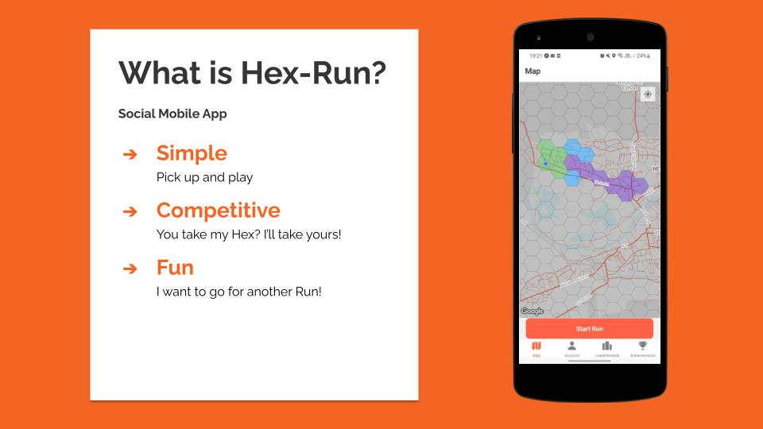

# HEX RUN

## SUMMARY

Built as a final project by myself and threee others. A multiplayer running game for iPhone and Android, designed to make exercise fun. It combines the background GPS locating, data visualisation and statistic tracking features of a serious fitness app like Strava with a hexagonal game board, allowing players to claim territory from others in real time simply by going for a run, while constantly working towards achievements to level up.

## TECHNOLOGIES

React Native + Expo
Turf.js
Firebase
Geolib
Victory Charts

## INSTRUCTIONS

#### CLONING

Click the code button, then copy the HTTPS link provided. In your Command Line, navigate to the directory where you want to clone the project, and enter `GIT CLONE REP_LINK_HERE` .

#### INSTALL DEPENDENCIES

Once cloned, in the same directory enter the command `NPM INSTALL` . You will need to have `NPM` installed for this to work.

## REQUIREMENTS

The app can be run through the Expo Go, either on an iOS or Android phone. You can run in a browser using Snack, though due to the app tracking your GPS location, you will not be able to experience much of its functionality.
